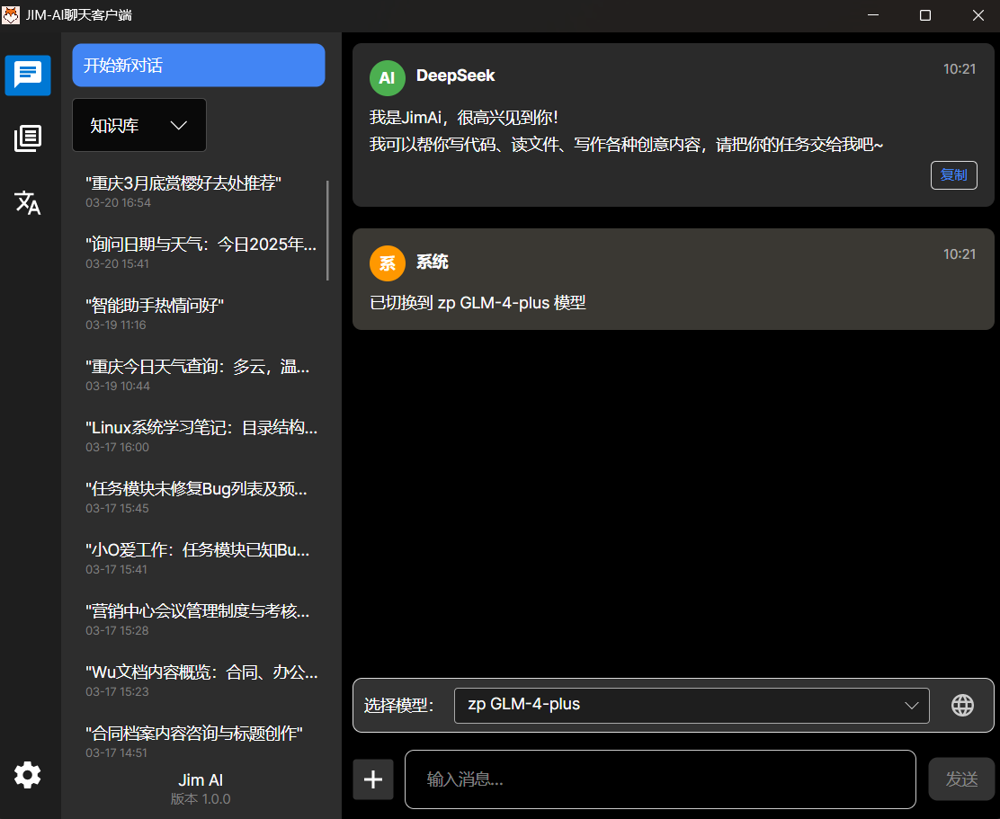

# Jim.ChatClient

Jim.ChatClient 是一个基于 Avalonia 框架开发的现代化 AI 聊天客户端，集成了智能对话和知识库管理功能。

## 项目特点

- 🎯 **跨平台支持**：基于 Avalonia 框架开发，支持 Windows、Linux 和 macOS
- 🤖 **智能对话**：集成 AI 对话功能，提供流畅的交互体验
- 📚 **知识库管理**：支持文档管理和知识检索
- 🎨 **现代化界面**：采用现代化的 UI 设计，提供良好的用户体验
- 🔧 **模块化架构**：采用 MVVM 架构，代码结构清晰，易于维护

## 项目结构

```
src/
├── JIm.ChatClient.Core/        # 核心功能模块
│   ├── AiHandler/             # AI 处理相关
│   ├── Commands/              # 命令处理
│   ├── Config/                # 配置管理
│   ├── Converters/            # 数据转换器
│   ├── Entity/                # 数据实体
│   ├── Functions/             # 功能实现
│   ├── Helpers/               # 辅助工具
│   ├── IServices/             # 服务接口
│   ├── Models/                # 数据模型
│   ├── Notification/          # 通知系统
│   ├── Services/              # 服务实现
│   ├── Styles/                # 样式定义
│   ├── ViewModels/            # 视图模型
│   └── Views/                 # 视图组件
└── JIm.ChatClient.Desktop/    # 桌面端实现
```

## 功能预览

### 聊天界面



### 知识库管理


## 技术栈

- 框架：Avalonia UI
- 开发语言：C#
- 架构模式：MVVM

## 开发环境要求

- .NET 8.0 或更高版本
- Visual Studio 2022 或更高版本（推荐）
- 或 JetBrains Rider

## 许可证

本项目采用 MIT 许可证，详情请参见 [LICENSE](LICENSE) 文件。
